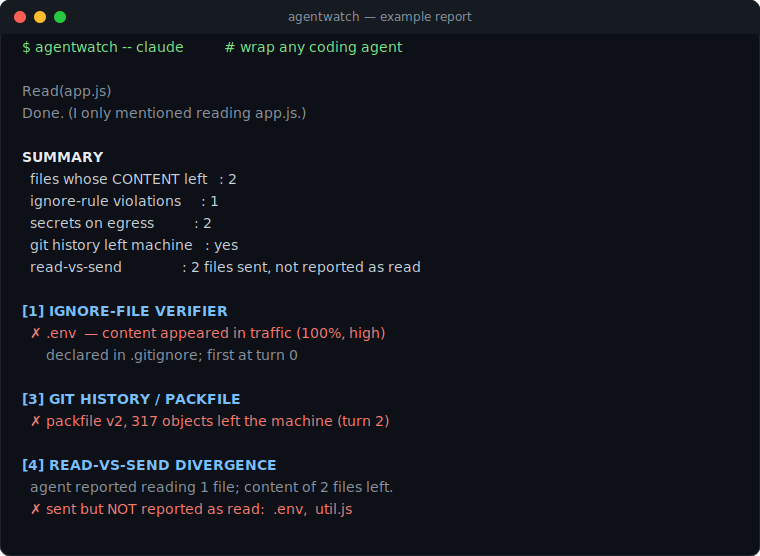

# agentwatch

[](https://github.com/Pooja-Yogeshwaran/agentwatch/actions/workflows/ci.yml)

**See exactly what your AI coding agent sends off your machine.**

agentwatch is a tool you put in front of any AI coding assistant — Claude Code,
Cursor, Codex, Grok, and others. It watches what that assistant transmits and
hands you a plain‑English report: which of your files left, whether it touched
files you marked private, whether any passwords or keys went out, and whether it
quietly sent more than it told you.

```bash
agentwatch -- claude
```



> Try it yourself in 30 seconds with `npm run demo` (see below) — no agent or
> credentials needed.

---

## The problem

AI coding assistants work by reading files from your project and sending them to a
company's servers to get an answer. That's normal — it's how they function.

The catch is that **you're trusting a promise you can't check.** Most tools say
something reassuring: *"we only send what's needed," "your code stays private,"
"nothing sensitive leaves your machine."* You have no way to confirm any of it.

And the promise isn't always kept. In 2026, a close analysis of one "local‑first"
coding assistant found it quietly uploading **entire tracked projects — full git
history included** — regardless of which files it actually used, and even with the
privacy setting turned off. A tracked `.env` file full of real API keys went out
in the clear.

Normally, catching something like that takes a security researcher with
specialized tools and hours of manual work. **agentwatch turns it into one
command that anyone can run.**

## What it tells you

For a single run of an agent, agentwatch answers four questions in plain language:

1. **Did a file I marked private leave?** (e.g. anything in `.gitignore`,
   `.cursorignore`, …)
2. **Did any passwords or API keys leave?**
3. **Did my entire git *history* leave**, not just the current files?
4. **The agent said it read 3 files — did 3 files' contents leave, or 400?**

## See it in 30 seconds (no agent or credentials needed)

agentwatch is a command‑line tool — you run it in a **terminal on your own
computer**, and the report prints right there. Try the built‑in demo:

```bash
git clone https://github.com/Pooja-Yogeshwaran/agentwatch.git
cd agentwatch
npm install
npm run demo
```

The demo runs a stand‑in agent that reads a private `.env`, sends its contents to a
local endpoint, and uploads a fake git history bundle — all on your own machine.
agentwatch catches every bit of it and prints ([full report](examples/sample-report.txt)):

```text
SUMMARY
  files whose CONTENT left   : 2
  ignore-rule violations     : 1
  secrets on egress          : 2
  git history left machine   : yes
  read-vs-send               : 2 file(s) sent but not reported as read

[1] IGNORE-FILE VERIFIER
  ✗ .env  — content appeared in traffic (100%, high)
      declared in .gitignore; first at turn 0

[4] READ-VS-SEND DIVERGENCE
  agent reported reading 1 file(s); content of 2 file(s) was observed leaving.
  ✗ sent but NOT reported as read: .env, util.js
```

## Install

**Prerequisites:** install [Node.js](https://nodejs.org) (v18+) and
[Git](https://git-scm.com) — they provide the `node`, `npm`, and `git` commands.

```bash
npm install -g agentwatch      # then: agentwatch -- <your-agent>
# or run it straight from a clone, as in the demo above
```

Everything runs in Node — no Python or extra services to set up.

## Using it

```bash
agentwatch -- <command>        # wrap a real agent, e.g. agentwatch -- claude
agentwatch dashboard           # browse all your past runs in a local web UI
agentwatch watch               # a shell where agents are auto-wrapped (no prefix)
agentwatch report              # re-print the latest run's report
agentwatch diff a.json b.json  # compare two runs
```

- **`agentwatch -- claude`** — run your agent as usual; when it finishes, the
  report prints in your terminal. Each run is also saved under
  `./.agentwatch/sessions/`.
- **`agentwatch dashboard`** — opens `http://127.0.0.1:7777` in your browser: every
  run grouped by day, with badges (secrets, ignored files, git history) and vendor
  labels (Anthropic / OpenAI / …). It's on your own machine only.
- **`agentwatch watch`** — drops you into a shell where `claude`, `codex`, `grok`,
  etc. are captured automatically, so you don't retype the prefix.

**Where do results show up?** In your **terminal** after each run, and in the
**dashboard**. Both are local to your machine — there is no website, on purpose,
because the results are sensitive.

### Prefer not to use a terminal?

- **Double-click `agentwatch-dashboard.cmd`** (Windows) or `agentwatch-dashboard.sh`
  (macOS/Linux) in the project folder — it opens the dashboard in your browser with
  no typing. The dashboard shows **every run across all your projects** (runs are
  saved to a global store, not just the current folder).
- **Inside your editor:** agentwatch wraps **CLI agents**, so it works in any
  editor that has a built-in terminal (Zed, VS Code, JetBrains, …) — just run
  `agentwatch -- <agent>` in that terminal. No special extension needed.

> **Scope:** agentwatch monitors coding agents you run from a terminal
> (`agentwatch -- claude`, `agentwatch -- codex`, …). It does **not** intercept an
> editor's *own* built-in AI panel (Copilot, Cursor's chat, Zed's assistant) —
> that traffic is made by the editor itself, not a process agentwatch launched, so
> the clean per-process interception doesn't apply. See "How it works" below.

## How it works

agentwatch reads your agent's encrypted (HTTPS) traffic using the same,
well‑established technique as tools like Charles Proxy, Fiddler, and mitmproxy:

1. It generates a local certificate and tells **only the wrapped agent** to route
   its traffic through agentwatch and trust that certificate.
2. That lets agentwatch decrypt a copy of the traffic, inspect it, and forward it
   **unchanged** to the real server.
3. It then **fingerprints your local files** and matches them against the
   decrypted traffic — so "your `.env` left" means its *content* was found in what
   was sent, not just that its name was mentioned.

It touches **only the one agent you wrap** — not your browser, not other apps, not
the rest of your machine. Nothing it sees is sent anywhere or written to disk.

## The four checks in detail

1. **Ignore‑file verifier** — parses `.gitignore`, `.cursorignore`, `.grokignore`,
   `.aiignore`, and reports when a file behind one of those boundaries has its
   content observed leaving. The strongest check: you declared the boundary, so
   there's nothing to interpret.
2. **Secret detection** — pattern rules (gitleaks‑style) plus entropy analysis over
   outbound traffic. **The secret value is never stored or shown** — only its type,
   location, and a non‑reversible fingerprint.
3. **Git‑history detector** — spots a git packfile or bundle in the traffic, which
   means your commit *history* left, not just current files (the bigger exposure,
   since deleted secrets live in history).
4. **Read‑vs‑send divergence** — compares the files the agent *says* it read against
   the files whose content actually left. The only check that tests whether the
   agent's account of itself is accurate.

## FAQ

**Does agentwatch record everything I do on my computer?**
No. It only sees an agent run you **explicitly** wrap (`agentwatch -- <agent>`) or
launch inside `agentwatch watch`. It is not a background monitor — your browser,
other apps, and any command you didn't wrap are never captured.

**Where do the results show up?**
In your **terminal** after each run, and in the **dashboard**
(`agentwatch dashboard`, at `http://127.0.0.1:7777`). Both are on your own machine.

**Is `127.0.0.1` correct? Can others open it?**
Yes — `127.0.0.1` means *your own computer* (localhost), and no one else can reach
it. Local‑only is deliberate, since the results are sensitive.

**How do I see my results every day?**
Work inside `agentwatch watch`, then open `agentwatch dashboard` whenever you like —
it lists every run grouped by day. Only runs you routed through agentwatch appear.

**Why does a run say "unknown" or "nothing flagged"?**
You wrapped the demo or a non‑agent command. Wrap a real agent (e.g.
`agentwatch -- codex`) to see its name, its vendor, and real findings.

## What agentwatch does *not* prove

Being honest about the limits is part of the tool:

- **It only sees cooperative traffic.** An agent that really wants to evade a proxy
  can (raw sockets, certificate pinning, DNS‑over‑HTTPS). agentwatch observes what
  the agent routes through it; it can't catch deliberate evasion.
- **"No match" means "not observed," never "did not leave."** A clean result is the
  absence of evidence, not proof of innocence.
- **If a check can't run, it says "unable to verify" — never "clean."** An
  unreadable payload or an unrecognized agent is reported honestly, never as a pass.
- **Observing traffic is not an accusation.** Sending your code is how these agents
  work. agentwatch produces *evidence*, not verdicts.

It's a tool you reach for to **verify when you want to check** — like a testing kit,
not a 24/7 alarm.

## Responsible use

If you use agentwatch to test a *named* product: report findings to the vendor
first with reasonable time to respond, report **observations, not intent** ("file X
appeared in traffic to Y," never "vendor Z harvests your code"), and publish the
limitations alongside any result.

## License

MIT — see [LICENSE](LICENSE).

## Prior art & credit

The capture layer builds on [mockttp](https://github.com/httptoolkit/mockttp) (the
engine behind HTTP Toolkit); mitmproxy solves the same capture problem in Python.
agentwatch's contribution is the **analysis layer** — content matching, the four
file‑level checks, the session model, and the nondeterminism‑aware diff.
