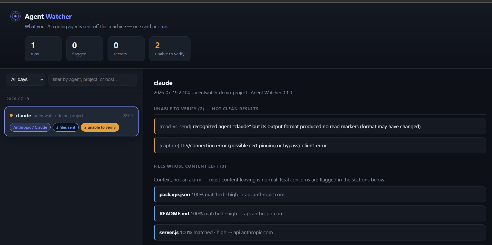
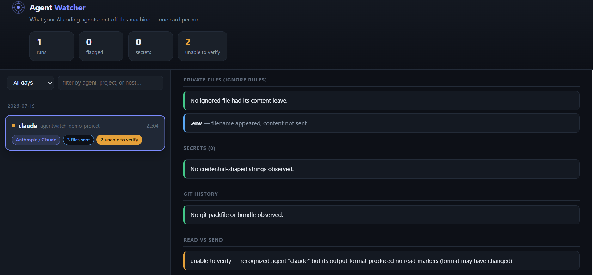
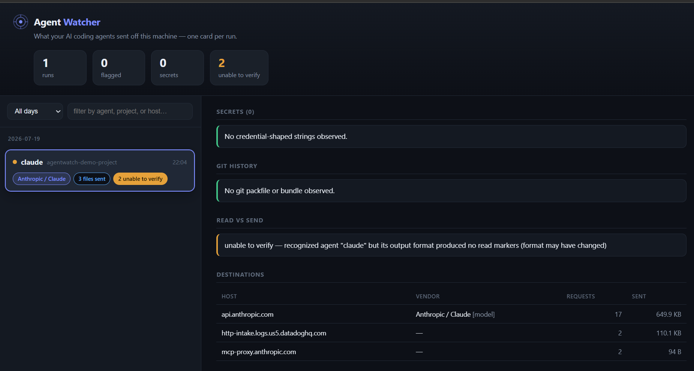

# Agent Watcher

[](https://github.com/Pooja-Yogeshwaran/agentwatch/actions/workflows/ci.yml)
[](LICENSE)

**See exactly what your AI coding agent sends off your machine.**

*(Run it with the `agentwatch` command.)*

Modern AI coding agents — Claude Code, Cursor, Codex, and others — read files from
your project and send them to a company's servers to do their work. That's normal;
it's how they function. The catch is that you're trusting their word about *what*
they send.

That word isn't always reliable. In 2026, analysis of one "local-first" coding
agent found it quietly uploading **entire tracked repositories — git history
included** — regardless of which files it actually used, and even with its privacy
setting switched off. A tracked `.env` full of real API keys went out in plain
sight. Catching something like that normally takes a security researcher with
specialized tooling. Almost nobody else can.

**Agent Watcher makes it one command.** You run your agent behind it, and it tells
you, in plain English, exactly what left your machine.

```bash
agentwatch -- <your agent>      # e.g. claude, codex, aider, grok, cursor-agent
```

> **Works with any command-line AI agent** — nothing here is Claude-specific.
> Replace `<your agent>` with whatever you run; the examples below just use
> `claude` as a stand-in.

> **It's a testing tool, not a background monitor.** You run Agent Watcher when you
> want to *check* something — evaluate a new agent before trusting it, audit a
> suspicious run, or verify a privacy claim. It watches the single run you wrap and
> then stops. It does **not** run in the background or track everything you do.

## What it tells you

For any single run of an agent:

- **Did a private file leave?** — anything in `.gitignore`, `.cursorignore`, etc.
- **Did any secrets leave?** — API keys, passwords, tokens.
- **Did your git *history* leave** — not just the current files?
- **Did it send more than it admitted to reading?**

## Install

Requires [Node.js](https://nodejs.org) 18+ and [Git](https://git-scm.com).

```bash
git clone https://github.com/Pooja-Yogeshwaran/agentwatch.git
cd agentwatch
npm install
```

## Quick start

**1. See it work first** — optional, no agent or credentials needed:

```bash
npm run demo
```

A stand-in agent runs entirely on localhost — it reads a gitignored `.env`, sends
it, and uploads a fake git bundle — so you can see a full report before pointing
agentwatch at anything real.

**2. Run your own agent** — put `agentwatch --` in front of it, from inside the
project you're working on:

```bash
cd path/to/your/project
node path/to/agentwatch/bin/agentwatch -- <your agent>
# e.g.  -- claude    -- codex    -- aider    -- grok
```

Use the agent exactly as you normally would. (Works the same in your editor — just
run that line in the editor's built-in terminal.)

**3. See your results.** The report prints in your terminal when the agent
finishes. For the visual dashboard of every run you've done:

- **Windows:** double-click **`agentwatch-dashboard.cmd`** — your browser opens the
  dashboard automatically.
- **macOS / Linux:** run **`./agentwatch-dashboard.sh`**.

## What you can monitor

agentwatch watches a command-line agent that it launches. That covers CLI agents
run anywhere — including inside your editor's terminal.

| How you use AI | agentwatch |
|---|---|
| A CLI agent — Claude Code CLI, `codex`, `aider`, `grok` | ✅ Supported |
| A CLI agent in your editor's terminal — Zed, VS Code, JetBrains | ✅ Supported |
| Your editor's built-in AI panel — Copilot, Cursor chat, Zed assistant | Out of scope |
| A desktop app — Claude Desktop, ChatGPT | Out of scope |
| A website — claude.ai, chatgpt.com | Out of scope |

*Out of scope* means agentwatch can't watch it: an editor's own AI and desktop apps
make their traffic themselves (not through a process agentwatch started), and a
website can't reach your local files in the first place — so there's nothing to
watch there.

## Understanding the output

Every run — in the terminal or the dashboard — reports the same things, color-coded
by how much they matter:

- 🔴 **Red — needs attention:** a private/gitignored file, a secret, or git history
  left the machine.
- 🟡 **Amber — unable to verify:** a check couldn't run (e.g. traffic wasn't
  intercepted). Never treated as "clean."
- 🔵 **Blue — informational:** files whose content left as part of normal work.
  Context, not an alarm.
- 🟢 **Green — clean:** nothing flagged.

A run shows a summary line, then the sections below. Here's what each one checks,
how it decides, and how to read its result.

### The foundation: content matching

Before any check, Agent Watcher **fingerprints every file in your project**
(whitespace-normalized and chunked) and matches those fingerprints against the
decrypted, decompressed traffic. This is what makes *"your `.env` left"* mean its
**content** was actually sent — not just that its name appeared somewhere. A
directory listing names hundreds of files whose contents never leave; those are
reported as *"filename appeared"* only, never as a leak.

- **Files whose content left** — 🔵 informational. Example:
  `package.json — 100% matched, high → api.anthropic.com`. The `%` is how much of
  the file was found in traffic (100% = the whole file; a lower number = only a
  snippet). This section is context — most content leaving is normal.

### 1. Ignore-file violations (private files)

- **Checks:** files you marked private — matched by `.gitignore`, `.cursorignore`,
  `.grokignore`, `.aiignore` — whose contents were sent anyway.
- **How:** it parses those ignore files into rules, finds which of your files they
  cover, and checks whether *those* files' content appeared in traffic. Content
  match = a violation; name-only = a lower-tier note.
- **Reading it:** 🔴 `✗ .env — content sent (100%, high), declared in .gitignore →
  api.anthropic.com` means a file you told tools to leave alone actually left.
  🔵 `~ .env — filename appeared, content not sent` means only its name showed up —
  no leak. **Red here is the strongest signal: you declared a boundary, and it was
  crossed.**

### 2. Secrets on egress

- **Checks:** credentials — API keys, passwords, tokens — in the outbound traffic.
- **How:** pattern rules (gitleaks-style: AWS keys, GitHub tokens, PEM headers,
  JWTs, connection strings, …) plus Shannon-entropy detection for high-randomness
  strings. To avoid false alarms, a high-entropy string counts as a secret only if
  it actually came from one of *your* files; random telemetry IDs are set aside.
- **Reading it:** 🔴 `✗ generic-secret-assignment (pattern) · fp:dd26… · from .env →
  api.anthropic.com` = a secret matching that rule, traced to your `.env`, went to
  Anthropic. **The secret value is never stored or shown** — only its type, a
  non-reversible fingerprint (`fp:`), its source file, and its destination. A secret
  resent every turn is one finding, not forty.

### 3. Git history / packfile

- **Checks:** whether your git *history* left — not just current files. This is the
  bigger exposure, because deleted secrets live forever in history.
- **How:** it scans the traffic (including inside multipart bodies and after
  decompression / base64) for the git `PACK` signature and bundle headers, and reads
  the header to count the objects.
- **Reading it:** 🔴 `✗ packfile v2, 317 objects → storage.example` means a git
  packfile containing 317 objects was uploaded — your commit history left the
  machine. A single, unambiguous flag.

### 4. Read vs send

- **Checks:** whether the agent sent more files than it *said* it read — does its
  own account match reality?
- **How:** it parses the agent's output for the files it claims to have read, then
  compares against the files whose content *actually* left (by content match, never
  filename mentions).
- **Reading it:** 🔴 `✗ sent but not reported as read: secret.js` means content of a
  file left that the agent never mentioned reading. If the agent's output format
  can't be parsed, it says 🟡 **"unable to verify"** rather than guessing — a false
  "all match" would be worse than admitting it couldn't check.

### Destinations

- **Checks:** every server the agent talked to, and how much went where.
- **Reading it:** `api.anthropic.com → Anthropic / Claude [model] · 17 req · 649 KB`.
  `[model]` = the AI endpoint where your prompts and files go; `[telemetry]` =
  analytics/logging. A host with no vendor label just isn't in the known-vendor list
  yet (you can add it in `rules/endpoints.yaml`).

## Example

We ran Claude Code on a small project and asked it a normal question — *"what does
this project do?"* Agent Watcher showed the files Claude read to answer, and
confirmed it did **not** send the gitignored `.env`: the filename appeared in a
directory listing, but its *contents* never left. (It flags a file only when its
actual bytes are sent — not when its name merely shows up.)







## How it works

agentwatch reads your agent's encrypted (HTTPS) traffic using the same technique as
Charles Proxy, Fiddler, and mitmproxy:

1. It generates a local certificate and tells **only the wrapped agent** to route
   its traffic through agentwatch and trust that certificate.
2. That lets it decrypt a copy of the traffic, inspect it, and forward it
   **unchanged** to the real server.
3. It **fingerprints your local files** and matches them against the decrypted
   traffic — so "your `.env` left" means its *content* was found in what was sent,
   not just that its name appeared.

It touches **only the one agent you wrap** — not your browser, other apps, or the
rest of your machine. Nothing it sees is sent anywhere or written to disk.

## Limitations

Being honest about the edges is part of the tool:

- **It only sees cooperative traffic.** An agent that pins certificates or opens raw
  sockets can bypass it. agentwatch observes what the agent routes through it.
- **"No match" means "not observed," never "did not leave."**
- **If a check can't run, it says "unable to verify" — never "clean."**
- **Observing traffic is not an accusation.** Sending your code is how these agents
  work; agentwatch produces evidence, not verdicts.

## Responsible use

If you use agentwatch to test a named product: report findings to the vendor first
with reasonable time to respond, report **observations, not intent** ("file X went
to Y," never "vendor Z harvests your code"), and publish the limitations alongside
any result.

## License

MIT — see [LICENSE](LICENSE). Built on
[mockttp](https://github.com/httptoolkit/mockttp); the analysis layer (content
matching, the four checks, the diff engine) is agentwatch's own.
